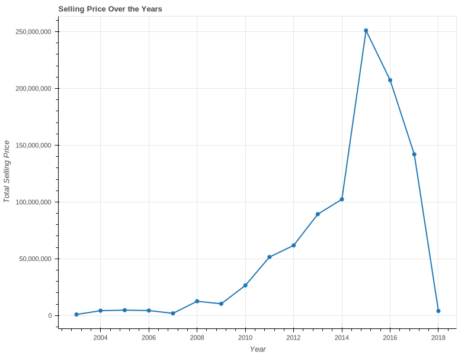

# Bokeh - Docs for science-focused exporting

## Introduction
Bokeh is a powerful tool for creating interactive visualizations and static plots. In this guide, we will discuss how to use Bokeh to create publication-quality plots that are suitable for use in academic journals and other publications. 

## Exporting Static Plots
Bokeh provides two methods for exporting static plots in PNG or SVG format: 
- `export_png()` and 
- `export_svgs()`

> These methods allow you to specify the size of the exported plot and the resolution (in dots per inch) as well as the background fill color to ensure that your plots are aesthetically pleasing.
The default export setting is `export_png()` and requires no backend setting. However, to use the `export_svgs()` successfully, the SVG backend needs to be activated by setting the 
`Plot.output_backend` attribute to "svg"

### How to pass your data with bokeh
- Lets use a car dataset for experimentation with these two methods.
---------------------------------

There are two major ways to pass your dataset to bokeh plots:
1. Using the ColumnDataSource function where you pass the entire dataset and only reference the feature needed in your plot 
	
		from bokeh.models import ColumnDataSource

		source = ColumnDataSource(df)

		plot.line('Year', 'Selling_Price')

2. Directly referencing the dataset feature using square bracket 

    
	    plot.line(df['Year'], df['Selling_Price'])
	    show(plot)

## Illustration
Lets use a car dataset for experimentation with these two methods.

    # import dependencies

	from bokeh.plotting import figure, show
	from bokeh.models import ColumnDataSource
	from bokeh.io import output_notebook, show
	from bokeh.plotting import figure
	from bokeh.models import NumeralTickFormatter
	from bokeh.io import export_png, export_svgs

	temp_df = df.groupby(['Year']).sum().reset_index()

    # add title and specify image size
	plot = figure(title='Selling Price Over the Years', height=400, width=800)

    # add x and y labels
	plot.xaxis.axis_label = 'Year'
	plot.yaxis.axis_label = 'Total Selling Price'

    # create plots
	plot.line(temp_df['Year'], temp_df['Selling_Price'], line_width=2)
	plot.circle(temp_df['Year'], temp_df['Selling_Price'], line_width=3)

    # format the y labe;
	plot.yaxis.formatter = NumeralTickFormatter(format='0,0')

    # display plot
	show(plot)

    #Export as PNG file
	export_png(plot, filename="examples/example1.png", height=600, width=800)

    # Export an SVG file
    plot.output_backend = "svg"
    export_svgs(plot, filename="examples/example2.svg", height=600, width=800)

### results

